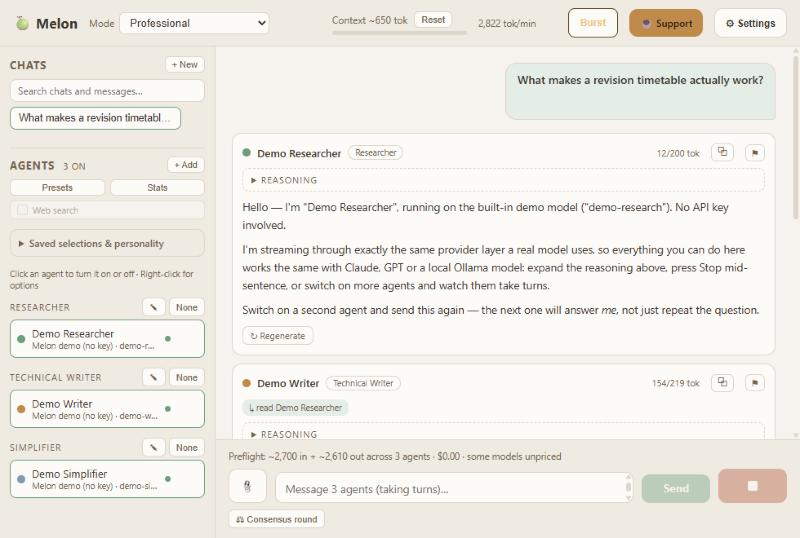

# 🍈 Melon

Universal multi-model AI: bring your own keys, activate the models you want, and let them work through a question **together** — taking turns and building on each other, not shouting over each other. A **Stop** button next to Send kills all activity instantly.



### ▶ Try it now — [va001-a11y.github.io/melon](https://va001-a11y.github.io/melon/)

Nothing to install. Pick **Melon demo (no key)** and watch two models take turns, or paste your own provider key. Everything runs in your browser: there is no Melon server, and your keys go straight from your browser to the provider you chose.

The hosted version reaches 17 of the 23 providers. Local models (Ollama, LM Studio, llama.cpp) and three services that refuse browser requests need the desktop version below — they are listed in the picker, greyed out, saying which.

## Run it on your machine

**Windows:** double-click **`Melon.bat`**. **macOS / Linux:** run **`./melon.command`** (on macOS, `chmod +x melon.command` once makes it double-clickable in Finder). Both are two-line wrappers around `scripts/launch.mjs`, so all three platforms share one implementation and cannot drift apart.

The launcher opens your **default browser**, whatever it is — Firefox, Vivaldi, Brave, Opera, Edge, Safari, Chrome. Melon uses only standard web APIs, so it runs in any current browser.

It checks for Node, installs dependencies on first run, reclaims any processes a previous run left behind, picks ports that are actually free on your machine, starts both servers, and opens the app. Close the window to shut it down. It works from any location — a desktop shortcut is fine.

```bash
npm install && npm run dev
```

## Features

- **Unified API layer** — adapters for Anthropic, OpenAI (and any OpenAI-compatible endpoint via custom base URL: Groq, Mistral, Together, OpenRouter, llama.cpp, ...), Google Gemini, and local Ollama. All streaming, all BYOK — keys live in your browser's localStorage and are only sent to your own local server, never stored server-side.
- **How agents converse** — tucked away in Settings, because the default should just work:
  - **One reply each** (default) — each agent answers once, then it comes back to you.
  - **Talk until they agree** — no turn limit. Agents keep discussing for as long as they need, and **end the conversation themselves** once every one of them has signalled agreement on a conclusion. Nothing is labelled or numbered, so it reads as one continuous exchange. If they never converge, the token budget, the context window, or **Stop** ends it.
  - **Fixed rounds (debate)** — a set number of passes, labelled *Round 2*, *Round 3*… since here the structure is the point.

  In the two multi-turn modes each agent is told who just spoke and asked to engage with a specific point — agree with a reason, push back, or ask a question — rather than restating itself.
- **Why is it waiting?** — Melon adds no delay of its own between turns (measured at 0 ms). A wait is always one of four things, and the card says which: the model is still writing (`writing… 4s`), a local model has not started yet because it is loading into memory and reading the prompt (`preparing… 40s` — the first request after a pause is the slowest, and a large model without a GPU can take minutes), an agent is queued behind another in relay mode (`waiting for Ana`), or your token pace is deliberately holding it back (`paused to slow spending`, with a banner naming the limit). Per-model time-to-first-token is in **Stats**.
- **Formatted replies** — models write Markdown by default, so Melon renders it: headings, **bold**, lists, blockquotes, code blocks, links and proper tables (which scroll rather than stretching the card). The renderer builds elements directly and never touches `innerHTML`, so model output cannot inject markup. Turn it off in Settings to see the raw source.
- **Token pace** — a slider capping output tokens per minute. It paces the stream itself, so a single agent's reply visibly slows too. Agents pause between turns to stay under it, so a long discussion stays readable and you have time to react. A live tok/min meter sits in the top bar and shows "pacing…" while it holds back.
- **Settings** (⚙) — themes, discussion length, reply length, simultaneous answering, reasoning display and token budget in one place.
- **Select theme** — six palettes (Paper, Mist, Sepia; Dusk, Ink, High contrast), applied instantly and remembered. Each also tells the browser which scheme it is, so scrollbars and menus match rather than staying stubbornly light on a dark theme.
- **Attachments** — 📎 or paste to attach **images** (PNG, JPEG, GIF, WebP), **PDFs** (text extracted in your browser, so any model can read them and nothing is uploaded to extract it), and **text or code files** (inlined). Audio and video are refused with an explanation rather than failing silently: chat models cannot listen.
- **Context guard** — the meter shows usage against the smallest active model's window. When a chat fills it, sending is blocked with a clear message instead of the provider erroring mid-run.
- **Collaboration by default** — agents answer **one at a time in sidebar order**, each receiving the full text of every teammate who answered before it in the same round, plus an instruction to build on it, correct it, or fill gaps. Each reply shows a `↳ read …` chip naming who it could see. Reorder speakers via right-click → Move up/down. Tick **Answer simultaneously** for the all-at-once mode — faster, but agents can't see each other *within* that round (they're running at the same instant); they still see everyone's answers from **previous** rounds either way.
- **Role templates** — Researcher, Technical Writer, Simplifier, Critic, Synthesizer, Generalist keep agents from duplicating work.
- **Click-to-toggle agents** — clicking an agent turns just that one on or off and never touches the others, so any combination is a few clicks. Right-click for a context menu (edit properties, turn on/off, use only this one, move up/down, duplicate, remove). Per-role group toggles switch whole roles at once.
- **Analytics dashboard** (Phase 3) — per-model calls, success rate, input/output tokens, output share, average latency, time to first token, and a flag rate. Plus session totals: runs, agent calls, bursts, extra discussion rounds, budget aborts. The ⚑ button on any response marks it inaccurate — that is the flag signal, an explicit record of *your* judgement rather than an automatic hallucination detector.
- **Shareable pipelines** — a preset carries the whole **workflow**, not just the cast: stage names, the brief each stage works to, and which agents sit where. Installing **Essay Pipeline** rebuilds *Sources → Draft → Simplify* in one click. Exporting hands that entire arrangement to someone else as one small JSON file — a pipeline you have tuned is a thing you can give away.
- **Agent presets** — one-click install of ready-made agent sets (Research Desk, Fact-Check Panel, Explain It Two Ways, Local Only, Writers' Room, and a keyless Demo Team) with provider, model, role and personality pre-filled. Export your own agents as a shareable JSON preset or import someone else's; presets never carry API keys.
- **Teams (pipelines)** — split the line-up into stages that run in order, each handed everything the previous stages produced. Every reply is labelled with the stage that produced it (`① Sources`, `② Draft`…), and the label is stored on the reply, so reopening an old chat shows how it actually ran even if the line-up has changed since. Single-team runs show no label, since there would be nothing to distinguish. Right-click an agent → *Move to Team 2* to start one. Name each team and give it a brief, e.g. **Sources** (Perplexity, Grok — gather evidence) → **Draft** (Claude, GPT — write the technical essay) → **Simplify** (Kimi, Llama — make it readable). Within a team agents work together as usual; between teams it is always sequential. **Merge** collapses everything back to one team.
- **Re-ask a question** — hover a message you sent and choose **Edit** to reword it and run it again. The replies below it are replaced, because they answered wording that no longer exists; **Branch from here** sits next to it if you want to keep both versions. Attachments come with the edited question rather than quietly detaching.
- **Saved selections** — separately, save which agents are currently on so you can restore the same line-up later.

### Preset files

Presets export as plain **`.json`** (`melon-preset-YYYY-MM-DD.json`), deliberately: anyone can open one in a text editor and see exactly what they are about to share or import. That transparency is the point — an opaque format would hide whether a secret slipped in.

**Secrets never leave the browser.** On export the API key is omitted entirely, and the base URL is stripped of query parameters and any embedded `user:pass@` credentials, because some APIs accept a key in the URL. On import Melon discards any `apiKey` it finds — a preset must never spend someone else's quota — and warns you so you can tell the sender to revoke it.
- **Support button** — an ☕ link in the top bar.
- **Chats panel** — pinned at the top of the sidebar, well separated from Agents at the bottom so a stray click can't hit the wrong one. Conversations save automatically; double-click or right-click to rename (your title is never overwritten), and opening a chat moves it to the top of the list.
- **Calm interface** — warm off-white paper with muted sage and clay accents, following your system light/dark preference. Nothing pure-white or pure-black, so long sessions stay easy on the eyes.
- **Agent editing in place** — right-click any agent → *Edit properties* opens the form pre-filled; change anything and save without deleting the agent.
- **Group presets** (Phase 2) — save the current activation state (which agents are on, which are focused) as a named preset and re-apply it in one click.
- **Personality engine** (Phase 2) — three-level inheritance composed into every system prompt: global personality (all agents) → role-group personality (✎ on the group header) → individual agent personality.
- **Burst mode** (Phase 2) — ⚡ button with an explicit consent dialog; bypasses the dynamic agent limit for the next run only, then disarms automatically. The hard cap of 100 and the token budget still apply during a burst.
- **Modes** — Professional (default), Sitcom, Meme/Creative, Research/Academic, Consensus/Fact-Check. Applied globally to every agent's system prompt.
- **Detailed CoT** — agents emit a cleaned, human-readable reasoning summary (assumptions, checks, alternatives) shown in a collapsible panel above each answer. No raw internal traces.
- **Stop** — sits next to Send, active only while agents are running. Kills every in-flight request server-side. Terminal by design: stopped replies are gone for good (no resume/pause) and you can send again immediately.
- **Context meter** — shows roughly how much of the current conversation agents must re-read each turn. **Reset** erases this chat's messages in place, keeping the chat and its name (use **+ New** to start a separate conversation).
- **Reply length** — Short / Medium / Long / Very long, capping how much each agent may write per turn. (This is the old "max tokens" control, in plain language.)
- **Per-reply actions** — every finished reply offers **Copy**, and **Regenerate** to ask that one agent again. A reply cut off by the length limit offers **Continue**, which picks up mid-sentence and appends rather than starting over. A failed one offers **Retry**. All of these re-run *only that agent*, so one bad answer never costs a whole round of everyone else's tokens.
- **Chat search** — searches titles *and* message text, so you can find a conversation by something said in it rather than only by its name. Appears once you have more than a few chats.
- **Cut-off replies explain themselves** — a reply that stops mid-sentence says why, rather than leaving you guessing: it hit the reply-length limit (with the exact number, and where to raise it), the provider's safety filter ended it, or you pressed Stop. Each provider reports this differently — `finish_reason`, `stop_reason`, `finishReason`, `done_reason` — and Melon normalises them.
- **Token guard** (Phase 2) — session-wide output token budget (settable in the top bar, 0 = unlimited). Burn is metered in real time while streams are live; the moment the budget is exhausted the whole run is aborted mid-stream. Aborted streams still count their partial burn. Budget bar + reset in the top bar.
- **Dynamic limit algorithm** (Phase 2) — the number of agents allowed to run in parallel is computed per-run from device profile (cores/memory), conversation complexity (history size), and remaining token budget, clamped to the hard cap of 100. Agents over the limit are auto-throttled (skipped, clearly labelled) and the reasons are surfaced in the UI.
- **Preflight cost estimates** (Phase 3) — a live line under the composer projects input/output tokens and USD for the next run across all active agents; runs estimated above $0.50 require explicit confirmation. Local Ollama and demo agents count as free; unpriced models are flagged rather than guessed.
- **Endpoint directory** (Phase 3) — the add-agent form ships a picker of known OpenAI-compatible providers (OpenRouter, xAI/Grok, Mistral, DeepSeek, Groq, Together, Fireworks, Perplexity, Cerebras, Moonshot…) that prefills base URL and an example model. Because `/chat/completions` is the de-facto standard, most services listed on directories like [AIxploria](https://www.aixploria.com/en/ultimate-list-ai/) plug in with just a base URL and a key — OpenRouter alone proxies 300+ models.
- **Consensus round** (Phase 3) — one click sends the panel's last answers back to every active agent to cross-check: where they agree, where they disagree and why, which claims look wrong, and a consensus verdict.
- **Guardrails** — hard cap of 100 agents enforced server-side, recommended 3–6 surfaced in the UI, token-burn warning when you exceed the recommendation, per-run max output tokens.

### Where your data lives

Chats, agents, API keys, presets, teams and settings are saved in your **browser's storage**, on your machine. They survive closing Melon, restarting the computer, and updating the app — nothing expires and there is no account.

The catch worth knowing: browser storage is tied to the exact address, **including the port**. Melon therefore remembers the port it used (in `.melon-ports.json`) and reuses it every launch, so your data is always where you left it. If something else has taken that port, Melon moves to another one, tells you clearly that this session will look empty, and explains how to get back.

Since it is browser storage, clearing your browsing data — or using a different browser — starts you fresh. Use **Presets → Export my agents** to keep a copy of a line-up you care about.

### Web search

Five providers search the web natively — Anthropic, Google, OpenRouter, Perplexity, and OpenAI's `-search-preview` models. Switch it on per agent and the model looks things up while it answers, billed by the provider.

Everything else has no search tool at all. For those, **Melon can do the searching itself**: it queries a search API, hands the results to the model as source material, and lists them as sources on the reply. That includes local models — an Ollama model on your own machine can answer from today's web.

Set it up in **Settings → Web search**. It needs its own key, separate from your model keys:

| Service | Free tier | Returns |
| --- | --- | --- |
| [Tavily](https://tavily.com) | 1,000 searches a month | Cleaned page text — better answers |
| [Brave Search](https://brave.com/search/api/) | 2,000 searches a month | Short descriptions |

**Search: all / none** in the agents panel switches it on for every agent that can search, instead of editing each one. Agents whose provider cannot search are left alone — an agent told to search when it cannot fails its turn deliberately, and a bulk action should not arm that.

**Agents see each other's sources.** In a relay, each agent is shown what its teammates cited, attributed to them by name. Melon's own search is shared across a run so those agents already read the same pages; provider-native search cannot be shared, since Claude, Gemini and Perplexity each search inside their own reasoning. Passing the source list on means an agent can say *"you used a social-media clip, I used Reuters"* instead of flatly contradicting a teammate for reasons neither of them can see.

Providers that can search natively keep doing so; Melon's search is the fallback, and each agent's settings say which one it will use. If search is switched on and neither is available, that agent fails with a message rather than quietly answering from memory — an answer that looks researched and is not is worse than no answer.

Search APIs are built server-to-server, so the hosted web build may be refused by CORS where the desktop build has no such limit. Melon reports what happened rather than guessing.

### Audio, and what to do instead

Melon does not transcribe audio, and refuses audio attachments rather than passing them to a model that will quietly ignore them. Chat models mostly cannot listen, and the ones that can are a minority of the catalog — while a model that silently drops the audio and answers anyway is the worst outcome of all.

**Transcribe it elsewhere, then attach the text.** A local transcriber — [Vibe](https://thewh1teagle.github.io/vibe/), MacWhisper, `whisper.cpp` — runs on your machine, so the recording never leaves it, and handles long files, timestamps and speakers far better than anything Melon could embed. Then:

1. Save the transcript as a `.txt`
2. Attach it with 📎 (text files are inlined, up to 4 MB each and 50 files per message)
3. Ask the panel about it

**Attach the file rather than pasting the text.** Same content reaches the model, but the conversation stays readable — a named chip instead of ten thousand words in the composer.

The thing to watch is not file size but **context**. A lesson transcript read by four agents is four copies of it in input tokens, measured against the smallest active model's window. The meter above the composer shows the total before you send, and Melon blocks rather than letting a provider fail halfway through. For a long recording, use fewer agents or models with larger windows.

### Security, and what Melon does not do

Melon is bring-your-own-key. Your keys stay in your browser, requests go straight from your machine to the provider you chose, and there is no Melon server, no account and no logging. Nobody but you and that provider sees a conversation.

**Melon adds no content filtering of its own, deliberately.** It is your key, your machine, and your agreement with the provider — who already enforce their own policies and can act on a key, which Melon cannot. A filter inside an MIT-licensed app you compile yourself would stop nobody who wanted it gone, while blocking legitimate questions for everyone who did not. The exception would be a hosted Melon running on someone else's key: that changes who the operator is, and it would need rate limiting and refusal. The demo on the web version is canned and keyless for exactly this reason.

**What Melon does defend against is the opposite direction: text arriving from outside trying to give your agents orders.** Agents are told that only your message sets the task, and that teammates' turns, web search results and attachments are material to weigh rather than instructions to obey. This matters more here than in a single-model chat, because Melon is a relay — one agent's reply becomes the next agent's input, so a hostile web page could otherwise travel down the whole line.

That is a prompt instruction, not a sandbox, so treat it as a speed bump rather than a wall. The standing advice is the one Melon shows you in the app: a reply that cites no sources is unverified, whoever wrote it.

**Where your keys actually live, and who could reach them.** Browser storage is scoped to the *origin* serving the page, and Melon does not own its origin in either build.

| Build | Origin | Who else can read that storage |
| --- | --- | --- |
| [Hosted](https://va001-a11y.github.io/melon/) | `va001-a11y.github.io` | Any page published to that GitHub account |
| Desktop | `http://127.0.0.1:5173` | Any other local dev server you run on that port — 5173 is Vite's default |

For the hosted version this means something worth stating outright: **using it is trusting whoever publishes it, not only the code.** A different page served from that same origin could read a key stored by Melon, and nothing ties the deployed files to this repository in a way a visitor can check. That is true of every hosted bring-your-own-key tool, not a quirk of this one — but it is the reason the hosted build exists mainly to try Melon with the keyless demo.

**If that matters to you, run it from source.** Clone the repository, read what you are about to run, and start it yourself. Then the only parties are you and your model provider, which is the arrangement the rest of this section describes.

**The rule that follows from this: nothing else gets published to that origin.** Other projects go on a separate account, an organisation, or their own domain. Browser storage cannot tell one page on an origin from another, so a second site there would sit next to Melon's keys whether or not anyone intended it to.

And if something else ever does share the origin, the narrower rule is **no third-party scripts on it**. A third-party script is a `<script src="…">` pointing at a domain you do not control — analytics, a chat widget, a comment system, an ad tag, a library pulled from a CDN. It runs *inside* the page rather than in a sandbox, so it can read everything the page can, including another site's stored keys. It does not need to be malicious to be a problem; it needs only to be compromised once. The same applies, less visibly, to an npm package bundled into a build: after bundling it is indistinguishable from your own code and has the same access. An `<iframe>` is different — it runs in its own origin and cannot reach your storage.

Melon itself loads nothing external. Its page references its own bundle and nothing else: no analytics, no CDN libraries, no web fonts. Every network request the app makes goes either to the model provider you chose or to your own machine.

The desktop row is the same property with a different neighbour: `127.0.0.1:5173` is Vite's default port, so another project of your own could share that storage. Melon pins its port deliberately — moving it would change the origin and make every saved chat, agent and key vanish, which is a worse outcome than the risk.


### Sending Melon to another computer

Don't copy the whole folder — run this instead:

```bash
npm run package
```

It writes **`Melon-<date>.zip`** next to the platform folder: about **110 KB**, versus 176 MB for the folder as it sits on disk. Send that one file by email, USB, or chat.

On the receiving computer:

1. Unzip it anywhere.
2. Run `Melon.bat` (Windows) or `./melon.command` (macOS/Linux).
3. The first run installs dependencies — needs internet, takes about a minute.

**Node.js must be installed there** ([nodejs.org](https://nodejs.org), LTS). Melon is a local web app and Node is the engine that runs it; if it's missing the launcher explains this and offers to open the download page.

Two reasons not to copy `node_modules` yourself:

- It is **172.9 MB of the 176.2 MB** total — over 99% of the size, and every byte of it is reconstructible.
- It contains binaries built for one operating system (`esbuild.exe`, `rollup-win32-x64-msvc.node`). Carrying those to a Mac doesn't just waste space, it breaks the install.

Your chats, agents and API keys live in the **browser**, not in these files, so they don't travel with the zip — add your keys again on the new machine.

### Publishing it on GitHub

**Push the source tree, not the zip.** A repository holding a single `.zip` is the shape malware takes; a repository holding readable TypeScript is the opposite, and readable source is the only real answer to "should I trust this?".

```bash
git init && git add . && git commit -m "Melon"
```

`.gitignore` already excludes `node_modules/`, `dist/`, `.melon-ports.json` and the `Melon-*.zip` build products, so what lands in the repo is exactly what a reader wants to see. Melon is bring-your-own-key and keeps keys in browser storage, so there is no `.env` to leak — but `.gitignore` blocks one anyway as a backstop.

The zip still has a job: attach it to a **GitHub Release**, for people who would rather download one file than use git. Repo for reading, release for running.

One thing to avoid: **don't email the zip.** Gmail blocks `.bat` attachments outright, including inside archives, and a downloaded `.bat` gets tagged by Windows so SmartScreen challenges it on first run. Send a link to the release instead — the same file, without the warnings.


## The web version

Melon also builds as a static site that runs entirely in the browser — no
Node, no install, no server. The same core does the orchestrating; only the
transport differs. It is live at
**[va001-a11y.github.io/melon](https://va001-a11y.github.io/melon/)**, published
from this repository by `.github/workflows/pages.yml`.

To run that build locally:

```bash
npm run web
```

Then open **http://127.0.0.1:5180/melon/**.

Two things are not available there, and the app says so rather than failing
quietly:

- **Local models.** Ollama, LM Studio and llama.cpp run on your machine, which
  a web page cannot reach.
- **Three providers** — NVIDIA NIM, Cerebras and GitHub Models — refuse
  cross-origin browser requests. That block is theirs, not something Melon can
  work around.

Both appear in the provider list, greyed out with the reason attached, so it
is clear what the desktop version adds rather than looking like a shorter
list. The other 17 work exactly as they do on the desktop, and keys still go
straight from your browser to the provider.

### Publishing it

`.github/workflows/pages.yml` builds and deploys to GitHub Pages on any `v*`
tag, or on demand from the Actions tab. It needs **Settings → Pages → Source:
GitHub Actions** switched on once; after that a release publishes the web
version as a side effect of tagging.

The `/melon/` path in the URL is the repo name — GitHub serves project sites
from a subdirectory, and that prefix is baked into the build. A custom domain
would make it `/` again (`client/vite.config.ts`).

### Known bugs, and fixed ones

[`docs/BUGS.md`](docs/BUGS.md) records every defect found in Melon and how it
was fixed, including the ones from before this repository existed. It is
organised by the patterns that produced them, because most were instances of
five recurring mistakes rather than isolated accidents.

## Adding models

Pick a provider from the grouped list, **type the model id exactly** as the provider writes it (lower case, dashes instead of spaces — e.g. `llama-3.3-70b-versatile`), paste your key, and press **Test connection** before saving.

The model box is deliberately never pre-filled: providers retire models on their own schedule, so a hardcoded default eventually points at something that no longer exists. Press **Fetch** and Melon asks the provider which models it serves *today*, then offers those in the dropdown.
 Melon knows each provider's endpoint, so you never type a URL unless you're using a local runtime or a custom service — and switching provider clears the previous endpoint and key, so an agent can never post to the wrong service.

Supported out of the box: **Anthropic, OpenAI, Google Gemini, xAI (Grok), Mistral, DeepSeek, Cohere, Perplexity, NVIDIA NIM (Nemotron), Moonshot (Kimi), Groq, Cerebras, Together, Fireworks, DeepInfra, OpenRouter, GitHub Models, Azure AI, Ollama, LM Studio, llama.cpp/vLLM**, plus **Custom OpenAI-compatible** for anything else — which covers most chat APIs listed on directories like [AIxploria](https://www.aixploria.com/en/ultimate-list-ai/). OpenRouter alone reaches 300+ models with one key.

> **On Copilot:** GitHub Copilot has no public chat API for third-party apps. **GitHub Models** is Microsoft's supported equivalent and is included — use a GitHub token with the `models` scope.

**No keys?** Pick the *Melon demo* provider, or install [Ollama](https://ollama.com) and run models locally for free.

### Local models (Ollama, LM Studio, llama.cpp)

Select a local provider and press **Detect local models** — Melon scans the usual ports, reports which runtimes are reachable, and fills the model list from what you actually have installed. If nothing is found it tells you what to run.

Local endpoints default to `127.0.0.1` rather than `localhost`, and Melon transparently retries the other loopback address family on failure: Node resolves `localhost` to IPv6 `::1` on some systems while Ollama binds to IPv4 only, which otherwise looks like "connection refused" even though Ollama is running.

- Client: http://127.0.0.1:5173 · Server: http://127.0.0.1:5175

Both are bound to `127.0.0.1` deliberately. On Windows `localhost` frequently resolves to IPv6 `::1` first, which breaks the client→server proxy and shows up in the app as *"Server not reachable"* even though the server is running perfectly. Using the IPv4 address on both sides removes that whole class of failure — and keeps Melon off your local network.

## Architecture

```
client (Vite/React :5173)
  └─ /api proxy ─► server (Express :5175)
        ├─ /api/registry   model capability registry (curated catalog)
        ├─ /api/run        SSE: fan out to active agents in parallel (dynamic limit applied)
        ├─ /api/stop       STOP TOKEN FLOW — terminal kill of all in-flight requests
        ├─ /api/guard      token guard state (session usage, budget)
        ├─ /api/guard/reset  reset session usage counter
        ├─ /api/analytics  per-model usage/performance (+ /reset, /flag)
        ├─ /api/extract-pdf  PDF → text so any model can read it
        ├─ /api/detect-local local runtime scan + Ollama diagnosis
        ├─ /api/marketplace  curated agent bundles
        ├─ /api/demo/v1    built-in keyless demo provider
        └─ providers/      anthropic | openai-compatible | google | ollama
```

Key server modules: `orchestrator.ts` (round loop + SSE), `catalog.ts` (providers, context windows, vision support), `stop.ts` (circuit breaker), `guard.ts` (token guard + dynamic limit), `prompts.ts` (roles, tones, personality, reasoning contract), `files.ts` (PDF extraction). Client theming lives in `client/src/themes.ts`, cost modelling in `client/src/cost.ts`.
